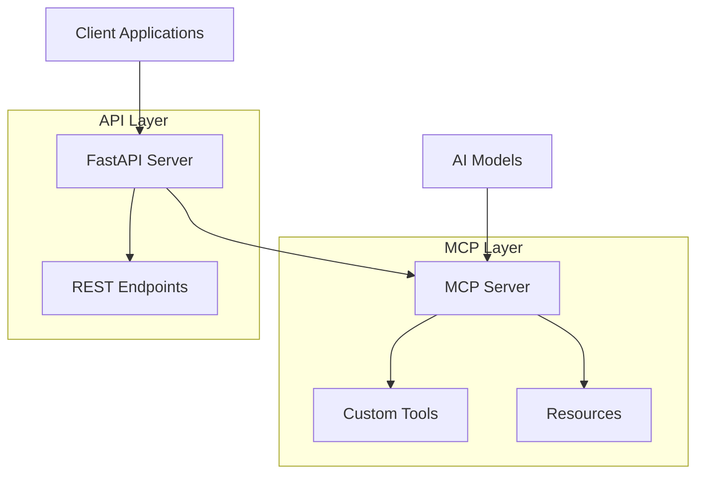

# MCP-SERVER-FASTMCP 🚀

A powerful integration project that combines **FastMCP** (Model Context Protocol) with **FastAPI** to create a seamless server-client architecture with custom tools and APIs.

## 📋 Table of Contents

- [Overview](#overview)
- [Features](#features)
- [Architecture](#architecture)
- [Quick Start](#quick-start)
- [Installation](#installation)
- [Project Structure](#project-structure)
- [Usage](#usage)
- [API Documentation](#api-documentation)
- [MCP Tools](#mcp-tools)
- [Configuration](#configuration)
- [Development](#development)
- [Contributing](#contributing)
- [License](#license)

## 🔍 Overview

This project demonstrates how to integrate **FastMCP** (a fast implementation of the Model Context Protocol) with **FastAPI** to create a robust server-client system. It provides:

- **MCP Server**: Custom tools and resources accessible via the Model Context Protocol
- **FastAPI Integration**: RESTful APIs that can interact with MCP servers
- **Custom Client**: A tailored client implementation for seamless communication
- **Tool Ecosystem**: Extensible tools that can be used by AI models and applications

## ✨ Features

- 🔧 **Custom MCP Tools**: Build and deploy custom tools for AI model interactions
- 🌐 **FastAPI Integration**: Modern, fast web APIs with automatic documentation
- 🔄 **Bidirectional Communication**: Seamless data flow between MCP and FastAPI
- 📊 **Real-time Monitoring**: Track server status and tool usage
- 🛠️ **Extensible Architecture**: Easy to add new tools and endpoints
- 📝 **Auto Documentation**: Swagger/OpenAPI documentation for all endpoints
- 🔐 **Secure by Default**: Built-in security features and best practices

## 🏗️ Architecture



## 🚀 Quick Start

1. **Clone the repository**
   ```bash
   git clone https://github.com/dabster108/MCP-SERVER-FASTMCP.git
   cd MCP-SERVER-FASTMCP
   ```

2. **Set up the environment**
   ```bash
   # Create and activate virtual environment
   python -m venv .venv
   source .venv/bin/activate  # On Windows: .venv\Scripts\activate
   
   # Install dependencies
   pip install -r requirements.txt
   ```

3. **Run the application**
   ```bash
   # Start the MCP server
   python mcp-server/server.py
   
   # In another terminal, start the FastAPI server
   python fastapi/main.py
   ```

4. **Access the API**
   - FastAPI Documentation: `http://localhost:8000/docs`
   - MCP Server: Available on configured port

## 📦 Installation

### Prerequisites

- Python 3.13+
- FastAPI
- FastMCP
- UV (recommended) or pip

### Using UV (Recommended)

```bash
# Install dependencies
uv sync

# Activate virtual environment
source .venv/bin/activate

# Run with UV
uv run python main.py
```

### Using pip

```bash
pip install -r requirements.txt
python main.py
```

## 📁 Project Structure

```
MCP-SERVER-FASTMCP/
├── README.md                 # Project documentation
├── pyproject.toml           # Project configuration
├── requirements.txt         # Python dependencies
├── main.py                 # Main application entry point
├── fastapi/
│   └── main.py            # FastAPI server implementation
├── mcp-server/
│   ├── server.py          # MCP server implementation
│   └── client.py          # Custom MCP client
└── .venv/                 # Virtual environment
```

## 🔧 Usage

### Starting the MCP Server

```python
# mcp-server/server.py
from fastmcp import MCP

app = MCP()

@app.tool()
def my_custom_tool(param: str) -> str:
    """A custom tool that processes input"""
    return f"Processed: {param}"

if __name__ == "__main__":
    app.run()
```

### FastAPI Integration

```python
# fastapi/main.py
from fastapi import FastAPI
from mcp_server.client import MCPClient

app = FastAPI(title="MCP-FastAPI Integration")
mcp_client = MCPClient()

@app.get("/tools")
async def list_tools():
    """List available MCP tools"""
    return await mcp_client.get_tools()

@app.post("/execute/{tool_name}")
async def execute_tool(tool_name: str, params: dict):
    """Execute an MCP tool"""
    return await mcp_client.execute_tool(tool_name, params)
```

### Custom Client Usage

```python
# mcp-server/client.py
from mcp import Client

class MCPClient:
    def __init__(self):
        self.client = Client()
    
    async def connect(self):
        await self.client.connect("mcp://localhost:3000")
    
    async def get_tools(self):
        return await self.client.list_tools()
```

## 📚 API Documentation

Once the FastAPI server is running, visit:

- **Swagger UI**: `http://localhost:8000/docs`
- **ReDoc**: `http://localhost:8000/redoc`
- **OpenAPI JSON**: `http://localhost:8000/openapi.json`

### Key Endpoints

| Method | Endpoint | Description |
|--------|----------|-------------|
| GET | `/tools` | List all available MCP tools |
| POST | `/tools/{tool_name}` | Execute a specific tool |
| GET | `/status` | Check server status |
| GET | `/resources` | List available resources |

## 🛠️ MCP Tools

### Creating Custom Tools

```python
@app.tool()
def data_processor(data: list, operation: str) -> dict:
    """Process data with specified operation"""
    if operation == "sum":
        return {"result": sum(data)}
    elif operation == "average":
        return {"result": sum(data) / len(data)}
    return {"error": "Unknown operation"}

@app.tool()
def api_caller(url: str, method: str = "GET") -> dict:
    """Make HTTP requests to external APIs"""
    import requests
    response = requests.request(method, url)
    return {
        "status_code": response.status_code,
        "data": response.json() if response.content else None
    }
```

### Available Tools

- **Data Processing Tools**: Handle various data operations
- **API Integration Tools**: Connect with external services
- **Utility Tools**: Common helper functions
- **Custom Business Logic**: Domain-specific operations

## ⚙️ Configuration

### Environment Variables

```bash
# .env
MCP_SERVER_HOST=localhost
MCP_SERVER_PORT=3000
FASTAPI_HOST=0.0.0.0
FASTAPI_PORT=8000
DEBUG=true
```

### Server Configuration

```python
# config.py
class Settings:
    mcp_server_host: str = "localhost"
    mcp_server_port: int = 3000
    fastapi_host: str = "0.0.0.0"
    fastapi_port: int = 8000
    debug: bool = False
```

## 👩‍💻 Development

### Setting up Development Environment

```bash
# Clone and setup
git clone https://github.com/dabster108/MCP-SERVER-FASTMCP.git
cd MCP-SERVER-FASTMCP

# Install development dependencies
uv add --dev pytest black isort mypy

# Run tests
uv run pytest

# Format code
uv run black .
uv run isort .
```

### Running Tests

```bash
# Run all tests
pytest

# Run with coverage
pytest --cov=. --cov-report=html

# Run specific test
pytest tests/test_mcp_server.py
```

### Code Quality

```bash
# Type checking
mypy .

# Linting
flake8 .

# Formatting
black --check .
isort --check-only .
```

## 🤝 Contributing

We welcome contributions! Please follow these steps:

1. **Fork the repository**
2. **Create a feature branch**: `git checkout -b feature/amazing-feature`
3. **Commit your changes**: `git commit -m 'Add amazing feature'`
4. **Push to the branch**: `git push origin feature/amazing-feature`
5. **Open a Pull Request**

### Contribution Guidelines

- Write clear commit messages
- Add tests for new features
- Update documentation as needed
- Follow the existing code style
- Ensure all tests pass

## 📄 License

This project is licensed under the MIT License - see the [LICENSE](LICENSE) file for details.

## 🙏 Acknowledgments

- **FastMCP**: For providing an excellent Model Context Protocol implementation
- **FastAPI**: For the modern, fast web framework
- **Community**: For feedback and contributions

## 📞 Support

- **Issues**: [GitHub Issues](https://github.com/dabster108/MCP-SERVER-FASTMCP/issues)
- **Discussions**: [GitHub Discussions](https://github.com/dabster108/MCP-SERVER-FASTMCP/discussions)
- **Email**: [Your Email]

---

**Happy Coding!** 🎉

Built with ❤️ using FastMCP and FastAPI